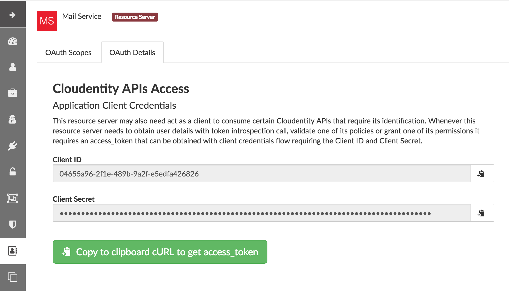

:toc:
:toclevels: 1

= Cloudentity Authorization Engine Integration

== Introduction
This repository contains reference source code and examples of integration of your application (or API Gateway) with Cloudentity
Authorization Engine (*TrUST Engine*) for policy validation. 

=== Why should I read it?
By reading this and utilizing code samples in this respository you will learn how to integrate with authorization engine with use of SDK.

=== Are there any pre-requisites?
It is recommended that you have the basic understanding of Cloudentity Authorization Engine and Cloudentity Authorization Policy structure prior going through this instruction. https://www.cloudentity.com/talk-to-us/[Contact us] for more details.

=== How do I get the TrUST Engine to integrate with?
There are two options to get it:

 * Install it in your local environment and explore all options (https://www.cloudentity.com/talk-to-us/[Contact us] for instruction)
 * Use demo IDaaS exposing TrUST engine APIs (click *Try* at https://www.cloudentity.com/[cloudentity.com] to get access)

=== I hear about Cloudentity TrUST engine for the first time. I want to learn more.
The Cloudentity TrUST Engine is powerful authorization engine that not only does RBAC, ABAC, Fine- and Corse- grained policy checks,
but also makes the decision whether User, Service or Thing (*UST*) is trusted enough to access a resource protected by the policy. https://www.cloudentity.com/talk-to-us/[Contact us] for more details

=== I want to try to validate a policy now to see how simple it is

The policies can be defined using policy editor or APIs and validated by an API call. Let's make the curl call to policy validation APIs of Cloudentity demo IDaaS to validate the simplest pre-defined, publicly available policy that alwayss passes. 

 curl -s -v -X POST https://demo.cloudentity.com/api/authz/policy/ALWAYS_PASS/validate

The response is `HTTP/1.1 200 OK` that means that policy passed. You've just validated your first policy. It was simple wasn't it? Continue reading to see how to integrate it with your SDK.

== Application Policy Validation With REST Call
The `ALWAYS_PASS` policy validated in the example above was a globally available policy that was neither assigned to an application nor tenant. This was used as an example yet such anonymous policy exposure is not the most typical example.

In this instruction we will focus on more typical scenario. We will validate policies assigned to applications. Applications are owned by organizations in the Cloudentity stack. By default the validation of such policies can be performed only by these applications. Before we jump to SDK based integration you will see how the applicaiton authenticates to validate its own policies to learn how it works by example.

[#alwayspasspolicy]
=== How to create a sample policy for my application?

First we need to create a sample application and define a policy that we will be validating. Go to the admin user interface and create the *ALWAYS_PASS* policy in an application with Resource Server and Authorization capabilities. The policy should look like the one on the image below. 

If you don't know how to create this policy follow the steps here <<createalwayspasspolicystepbystep>>

=== How to validate application policy?
The application policy can only be validated by the application that owns the policy.
Unlike in case of validation of the publicly available policy in the first example, now the application will have to authenticate
to make a call to the policy validation endpoint. The authentication will be happening using OAuth2 access_token.

To get the token go to the *OAuth Details* tab and click the green button to copy the cURL triggering client credentials flow
with the application credentials to the clipboard.

[#applicationconfiguration]

Execute the command from the clipboard in the terminal. You will get the response in the format below with the access_token that  you need.

[source,json]
[subs=+quotes]
----
{"access_token":"*<COPY_THIS_ACCESS_TOKEN>*","token_type":"Bearer","expires_in":3599,"scope":"address phone openid email profile"}
----

Use the access_token to authenticate the policy validation call. Execute the following curl command to validate your policy.
 
[source, command]
[subs=+quotes]
curl -v -X POST https://demo.cloudentity.com/api/authz/application/policy/ALWAYS_PASS/validate -H 'Content-Type: application/json' -H 'Authorization: Bearer *<PASTE_ACCESS_TOKEN_HERE>*'

You got `HTTP 200` in the response which means you've just created and validated your first application policy.

[#generatingClientUsingSDK]
== Authorization Engine Integration Using SDK
Let's validate policies using SDK to demonstrate how to integrate your application with the authorization engine. 

=== What is the specification of the API validation endpoint?
Swagger document for this endpoint can be found link:readme-attachments/application-policy-validation.yaml[here]

NOTE: In the provided swagger document the Cloudentity Stack base url is set to https://demo.cloudentity.com.
If you are using other environment like the local one replace any occurrence of this address in this file prior generating the client using this file.

[#generatePolicySDK]
=== How to build SDK from the swagger document ?
Use https://github.com/swagger-api/swagger-codegen[Swagger-CodeGen] to generate client for your preferred language based on the swagger document for this endpoint.

For Java the steps will be following:

. Download http://central.maven.org/maven2/io/swagger/swagger-codegen-cli/2.4.1/swagger-codegen-cli-2.4.1.jar[Codegen 2.4.1] *.jar file
. Prepare json config with preferred values for package name etc and store is as a file link:readme-attachments/application-policy-validation-client-java.json[policy-validation-client-java.json]
[source,json]
{
  "apiPackage": "com.cloudentity.libs.trustengine.client.api",
  "modelPackage": "com.cloudentity.libs.trustengine.client.model",
  "invokerPackage": "com.cloudentity.libs.trustengine.client",
  "groupId":"com.cloudentity.libs.trustengine",
  "artifactId":"client",
  "artifactVersion":"1.0.0",
  "library":"feign"
}
. Generate client code using command which will generate java client project in `application-policy-validation-client` directory where:
- `-c` is a path to json config file of the client
- `-i` is a path to swagger doc
- `-o` is name of the output folder where source will be generated
[source, command]
java -jar swagger-codegen-cli-2.4.1.jar generate -c policy-validation-client-java.json -i application-policy-validation.yaml -l java -o application-policy-validation-client
. Assuming Maven is used as dependency manager and no custom adjustments for generated code is required you can build
and install it locally by going inside the `application-policy-validation-client` folder and executing command:
[source, command]
mvn clean install
. Import locally installed artifact into your Java Maven project:
[source, xml]
<dependency>
  <groupId>com.cloudentity.libs.trustengine</groupId>
  <artifactId>client</artifactId>
  <version>1.0.0</version>
</dependency>

=== How to configure SDK to connect to the TrUST Engine instance?
. Create a java project and set the dependency to the client above in your pom.xml
. Create a sample class and add necessary imports
[source, java]
import com.cloudentity.libs.trustengine.client.ApiClient;
import com.cloudentity.libs.trustengine.client.api.AuthzApi;
import com.cloudentity.libs.trustengine.client.model.ValidatorsData;
import static com.cloudentity.examples.trustengine.config.Credentials.*;
import feign.FeignException;

. Init the `ApiClient` with the application credentials i.e. Client Id and Client Secret that you configured in the section <<applicationconfiguration, here>> while setting up the app. 

[source, java]
public class SamplePolicyValidation {
  private static final ApiClient client = new ApiClient("oauth2_clientCredentials", clientId, clientSecret, null, null);
  private static AuthzApi authorizationServiceClient = client.buildClient(AuthzApi.class);
}

NOTE: Remember that only application owning the policy can validate such policy, thus the application needs to be identified. The SDK will handle the generation of the access_token that needs to be send with each call. 

. Make a call to the TrUST Engine by using the TrustEngine method generated by the Codegen signature of which looks like this:
[source, java]
void postAuthzApplicationPolicyWithPolicyNameValidate(@Param("policyName") String policyName, @Param("xOriginalAuthorization") String xOriginalAuthorization, ValidatorsData body);

where:

- `policyName` is the name of application policy to validate
- `xOriginalAuthorization` is optional user authorization key (for example used in Context Driven ABAC where we set there user Access Token). Set it `null` if user context not required
- `body` is the POST body request where you can provide data that can be used during validation. Set it `new ValidatorsData()` if additional data in body required.

=== How do I validate Application Policy with SDK?
Let's see how to use SDK to validate a very simple policy i.e. ALWAYS_PASS Policy <<alwayspasspolicy,created earlier>>.

Post the initiation of the `APIClient` you just need to make the following method call:
[source, java]
try {
      log.info("Validating if policy passes");
      authorizationServiceClient.postAuthzApplicationPolicyWithPolicyNameValidate("ALWAYS_PASS", null, new ValidatorsData());
      log.info("Policy validated successfully");
    } catch (FeignException e) {
      log.warn("Request failed with status error: {}, message: {}", e.status(), e.getMessage());
    }

Code of the class can be found link:src/main/java/com/cloudentity/examples/trustengine/AlwaysPassPolicyValidation.java[here].

As you can see everything is as simple as possible. The example code when run will print information that policy was 
validated successfully or error if for some reason validation failed. 

=== More advanced examples
As for now we only demonstrated very limited usage of TrUSTEngine.
To reveal real power of it we need to move towards some more sophisticated access control validation.

Below we are presenting examples how to validate attribute based access control (ABAC), role based access control (RBAC)
and Fine-grained permission access control. If you want to read more about how those policies were build you can read
simple overview in section <<coupleWordsAboutPolicies>>.

If you want to play with our examples just clone the repo and run those examples (each class has `main` method ready to be executed).
Before you do please make sure you generated and installed locally both TrUSTEngine client (<<generatePolicySDK>>)
and Permission Management client (<<generatePermissionsClient>>) required to compile the project.

==== Basic ABAC Application Policy Validation
This link:src/main/java/com/cloudentity/examples/trustengine/BasicABACPolicyValidation.java[example class] shows
how to make ABAC validation based only on attributes provided in request.

Body of the request looks like:
[source, json]
{
  "attributes": {
    "age": 43
  }
}

In this example `OLDER_THEN_38` Policy is validated and it passed as long as provided `age` attribute is higher then 38.

==== Context Driven ABAC Application Policy Validation
This link:src/main/java/com/cloudentity/examples/trustengine/ABACApplicationPolicyValidationWithUserContextFromUserAccessToken.java[example] is more complicated as it uses Policy that relies on user context. User parameters are not send in the request
but are retrieved from Cloudentity storage based on authorization key in the request.

To make it work you need to first get user access token and then set it in Credentials class.
Getting user access token is out of the scope of this example. The easiest way is to simply create application
of kind `Single Page Application` in developer UI and follow the Quick Start description of how to create app
and be able to retrieve access token for user.

Based on this token TrustEngine get's user uuid from Cloudentity introspection endpoint and fill user context.
Then policy `ONLY_JOHN_ALLOWED` validates if user firstname is `John`.
Once you make this example work you can change the name for the user in runtime (no need to generate new token)
and see that policy fails if user name is not equal to `John`.

==== RBAC Application Policy Validation
This link:src/main/java/com/cloudentity/examples/trustengine/RBACApplicationPolicyValidation.java[example] demonstrate how Cloudentity handle RBAC policy validation.

RBAC is done using coarse-grained Permissions and Policy `CAN_ACCESS_RBAC` validated in this example uses
Permission Validator which verifies if user with provided id has Permission `FILES_SUPERVISOR`.
User id is provided in the request attributes.

Body of the request looks like:
[source, json]
{
  "attributes": {
    "userUuid": "12345"
  }
}

This example fails without proper permissions granted for user.
Read <<permissionManagement>> section to see how to grant permission for user to make it pass.

==== Fine-grained Permissions Application Policy Validation
This link:src/main/java/com/cloudentity/examples/trustengine/FineGrainedPermissionsValidation.java[example] demonstrate how to validate fine-grained permissions in Cloudentity Stack.

Policy `CAN_ACCESS` uses Fine-grained Permissions Validator which validates if user identified by id provided in request has permission `HAS_ACCESS` to file of name
provided in attribute `fileId`.

Body of the request looks like:
[source, json]
{
  "attributes": {
    "userUuid": "12345",
    "fileId": "some_file.txt"
  }
}

This example fails without proper permissions granted for user.
Read <<permissionManagement>> section to see how to grant permission for user to make it pass.

[#permissionManagement]
=== Permission Management
Above examples (RBAC and Fine-grained Permissions) rely on Permissions.
If you go though those examples you will find them failing as "users" used there do not have proper permissions granted.
This link:src/main/java/com/cloudentity/examples/trustengine/PermissionManagement.java[class] demonstrates how to create Permissions and grant them for user.
Once this example is successfully executed all examples should pass.

Flow in this example:

. create permissions for application (HAS_ACCESS, FILES_SUPERVISOR)
. validate that permissions were added
. list user granted permissions and if any remove them
. grant user coarse-grained permission FILES_SUPERVISOR
. grant user fine-grained permission HAS_ACCESS for file `some_file.txt`
. list final set of permissions for user

[#coupleWordsAboutPolicies]
== Couple words about policies and access control
Cloudentity Stack supports many ways of managing resource service access, like

- <<ABAC>>
- <<RBAC>>
- <<FGAC>>

[#ABAC]
=== ABAC (attribute based access control)
There are 2 main ways of handling ABAC in Cloudentity Stack

- basic ABAC where all data is provided during policy validation and validation is simple comparision if attribute X matches some criteria
- context-driven ABAC where object data is in the context and context is populated based on some authentication key

==== Simple ABAC
For simple ABAC Cloudentity provides Cross Context Validator that has access to attributes from the request.
This way it is easy to match some attribute against static validation restrictions.

==== Context Driven ABAC
In Context Driven ABAC attributes are not taken from request. Validation is done against attributes in context.
Example contexts accessible:

- user context
- organization context

Data in context is filled based on authentication key provided during policy validation.

==== ABAC Policy
Simply create new Policy for your application and then

- for *basic ABAC* choose `Cross Context` validator and fill the form based on your expectations
- for *Context Driven ABAC* choose either `User attributes` or `Organization attributes` or whatever context you need and set your expectation in the form.

Let's see how example basic ABAC Policy which validates if provided attribute of name age is greater then 38 looks like

If you want to use Context Driver ABAC your policy would looks more like this

[#RBAC]
=== RBAC (role based access control)
Role based access is done using Coarse-grained Permissions. Permission is and abstract concept of `someone having some right/access/permission
to something`. Permissions are managed by application owner. In Cloudentity Stack managing (listing, granting, revoking, creating)
permissions requires oauth2 access token with Client Credentials grant.

==== RBAC Policy
Once all permissions are correctly assigned you can start validating RBAC using Permission Validator in Policy.

Simply create new Policy for your application, choose `Permission` validator and fill the form based on your expectations

Example RBAC Policy which validates permission with attributes from request may looks like this

NOTE: If policy validation would be done using just Client Credentials access token (so without user context)
then Fine-grained Permission Validator should not rely on `Current customer` but principal must be explicitly provided via `Custom value`.

NOTE: If you want to provide principal as request parameter (rather then hardcode it in policy)
simply put those vales in json body during validation call under `attributes` field which then can be accessed
using $attributes prefix in ID fields in validator.

[#FGAC]
=== Fine-grained Access Control
Fine grained access is done using Permissions. Permission is and abstract concept of `someone having some right/access/permission
to something`. Permissions are managed by application owner. In Cloudentity Stack managing (listing, granting, revoking, creating)
permissions requires OAuth2 Access Token received from Client Credentials flow.

==== Fine-grained Access Control Policy
Once all permissions are correctly assigned, you can start validating Fine-grained Access Control using Fine-grained Permission Validator in application Policy.

Simply create new Policy for your application, choose `Fine-grained Permission` validator and fill the form based on your expectations.

Example Fine Grained Policy which validates permission with attributes from request may look like this

NOTE: If policy validation would be done using just Client Credentials Access Token (so without user context)
then Fine-grained Permission Validator should not rely on `Current customer` but principal, must be explicitly provided via `Custom value`.

NOTE: If you want to provide principal and object as request parameter (rather then hardcode it in policy)
simply put those vales in json body during validation call under `attributes` field which then can be accessed
using $attributes prefix in ID fields in validator.

=== Managing Permissions for RBAC and Fine-grained Access Control
Having proper Access Token application owner can do several things like:

. List all application permissions
[source, curl]
curl https://local.cloudentity.com/api/permissions/application/permission/list -H 'Authorization: Bearer ACCESS_TOKEN'
. Create new permission
[source, curl]
curl -X PUT https://local.cloudentity.com/api/permissions/application/permission -d '{"name":"CAN_ACCESS"}' -H 'Content-Type: application/json' -H 'Authorization: Bearer ACCESS_TOKEN'
. Grant permission for principal (Coarse-grained Permissions - RBAC)
[source, curl]
curl -X PUT https://local.cloudentity.com/api/permissions/application/grant -d '{"name":"CAN_ACCESS", "principal": "user:123"}' -H 'Content-Type: application/json' -H 'Authorization: Bearer ACCESS_TOKEN'
. Grant permission for principal to object (Fine-grained Permissions)
[source, curl]
curl -X PUT https://local.cloudentity.com/api/permissions/application/grant -d '{"name":"CAN_ACCESS", "principal": "user:123", "object": "file:some_file.txt"}' -H 'Content-Type: application/json' -H 'Authorization: Bearer ACCESS_TOKEN'

[#generatePermissionsClient]
==== Generate Permissions SDK
You can generate client for your preferred language to interact with Permission Service instead of sending curl requests.
To do that follow instructions for generating SDK for policy validation under <<generatingClientUsingSDK>>.

For Java it should be
[source, command]
java -jar swagger-codegen-cli-2.4.1.jar generate -c permission-management-client-java.json -i permission-management.yaml -l java -o permission-management-client

Swagger doc for basic Permission Management can be found link:readme-attachments/permission-management.yaml[here].
Client json config can be found link:readme-attachments/permission-management-client-java.json[here].

[#createalwayspasspolicystepbystep]
== How to create the sample ALWAYS_PASS policy step by step
Log in to Cloudentity user interface as an admin and go to your application in applications tab. 

If you don't have an application yet create one by clicking the create button. Remember to add *Authorization* and *Resource Server* capabilities to the application. 

If you can't select more than one capability during the application creation, select one add the second one later by clicking *Add Capability* button on the application view post the application creation.

Once it is done create a policy for this application in the application's policies tab.

We will start with the simplest policy that always passes, so when asked about the policy name use the *ALWAYS_PASS* name.

The graphical editor added a default validator to the policy that is ALWAYS_FAIL that we'll have to replace it with the desired one. Click the garbage bin icon on the validator to remove this validator.

Confirm the removal

Click add new validator on the policy

Select the *ALWAYS_PASS* validator

Click save on the policy

You just created the *ALWAYS_PASS* policy with a single validator

== Frequently Asked Questions